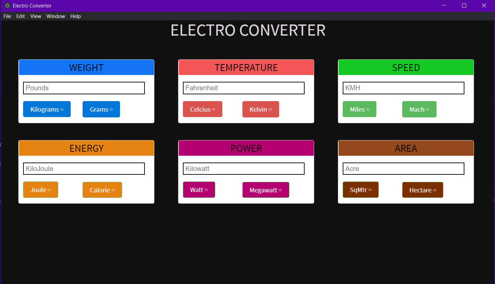

# Electro Converter

Electro Converter is an Electron-based Desktop Application which allows some Mathematical Conversions like Temperature, Speed, Light, and Weight. Currently this calculator only supports only Four Conversions, More Features will be added in future builds.

### Note - Support for Linux & Mac will available in future.

### How To Install

Check Releases to download installer.

## Screenshot

